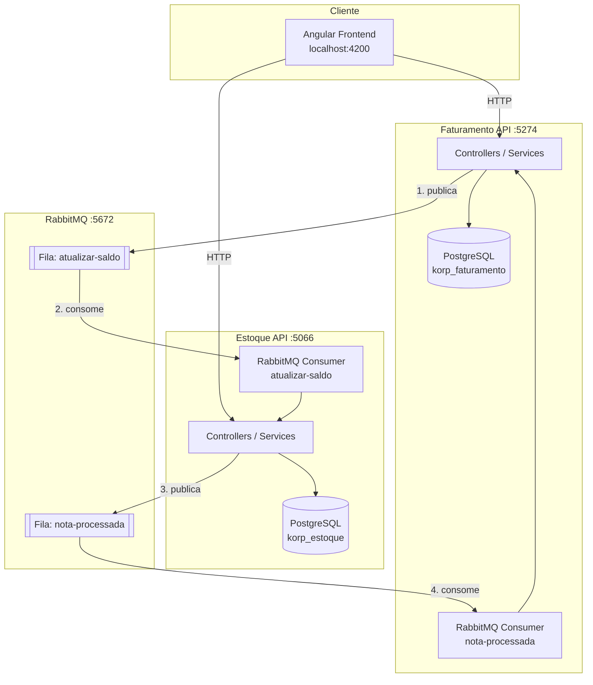

# Korp

Sistema de emissão de notas fiscais com cadastro de produtos, controle de estoque e processamento assíncrono entre microsserviços.

## Sobre o projeto

A solução é composta por:

- **Estoque API**: cadastro, consulta, edição e exclusão de produtos, além do controle de saldo.
- **Faturamento API**: criação, consulta e fechamento de notas fiscais.
- **Frontend Angular**: interface para gerenciamento de produtos e notas fiscais.
- **PostgreSQL**: persistência dos dados de estoque e faturamento em bancos separados.
- **RabbitMQ**: integração assíncrona para atualizar o estoque e confirmar o processamento da nota.

## Tecnologias

- .NET 10
- ASP.NET Core Web API
- Entity Framework Core 10
- PostgreSQL 16
- RabbitMQ 4 Management
- Angular 21
- TypeScript 5.9
- RxJS 7.8
- Docker Compose

## Arquitetura



### Fluxo de fechamento

1. Uma nota é criada com status `Aberta`.
2. O usuário solicita a impressão da nota.
3. O Faturamento API muda o status para `Processando`.
4. Uma mensagem é publicada na fila `atualizar-saldo`.
5. O Estoque API consome a mensagem e deduz as quantidades dos produtos.
6. O Estoque API publica uma confirmação na fila `nota-processada`.
7. O Faturamento API consome a confirmação e altera a nota para `Fechada`.
8. O frontend atualiza os dados e abre a impressão do navegador.

Os consumidores RabbitMQ são executados como `BackgroundService`, com confirmação manual das mensagens (`autoAck: false`).

## Pré-requisitos

- Docker Desktop com Docker Compose
- .NET SDK 10
- Node.js e npm

## Como executar

### 1. Subir APIs e infraestrutura

Na raiz do projeto:

```bash
docker compose up --build
```

O Compose inicia PostgreSQL, RabbitMQ, Estoque API e Faturamento API. As credenciais padrão são:

| Recurso | Valor |
| --- | --- |
| PostgreSQL usuário | `korp_user` |
| PostgreSQL senha | `korp_senha` |
| RabbitMQ usuário | `admin` |
| RabbitMQ senha | `admin` |

### 2. Subir o frontend

Em outro terminal:

```bash
cd frontend
npm install
npm start
```

Acesse `http://localhost:4200`.

## Endereços dos serviços

| Serviço | Endereço |
| --- | --- |
| Frontend | http://localhost:4200 |
| Estoque API | http://localhost:5066 |
| Faturamento API | http://localhost:5274 |
| Swagger Estoque | http://localhost:5066/swagger |
| Swagger Faturamento | http://localhost:5274/swagger |
| PostgreSQL | localhost:5432 |
| RabbitMQ AMQP | localhost:5672 |
| RabbitMQ Management | http://localhost:15672 |

## Funcionalidades do frontend

| Rota | Funcionalidade |
| --- | --- |
| `/produtos` | Lista e exclui produtos |
| `/produtos/novo` | Cadastra produtos |
| `/produtos/:id/editar` | Edita produtos |
| `/notas-fiscais` | Lista notas fiscais |
| `/notas-fiscais/nova` | Cria notas com múltiplos itens |
| `/notas-fiscais/:id` | Visualiza e imprime uma nota |

O frontend utiliza `ReactiveFormsModule` para o cadastro de produtos, `HttpClient` para as APIs, `OnInit` para carregamento inicial, signals para estado local e RxJS para operações assíncronas.

## API de Estoque

Base URL: `http://localhost:5066/api/Produtos`

| Método | Rota | Descrição |
| --- | --- | --- |
| `GET` | `/api/Produtos` | Lista produtos |
| `GET` | `/api/Produtos/{id}` | Consulta um produto |
| `POST` | `/api/Produtos` | Cadastra um produto |
| `PUT` | `/api/Produtos/{id}` | Atualiza um produto |
| `DELETE` | `/api/Produtos/{id}` | Exclui um produto |
| `PUT` | `/api/Produtos/{id}/atualizar-saldo` | Deduz uma quantidade do saldo |

Exemplo de cadastro:

```json
{
  "codigo": "P001",
  "descricao": "Produto de exemplo",
  "saldo": 10
}
```

A API valida código e descrição obrigatórios, saldo não negativo e unicidade do código. Saldo insuficiente retorna `409 Conflict`.

## API de Faturamento

Base URL: `http://localhost:5274/api/NotasFiscais`

| Método | Rota | Descrição |
| --- | --- | --- |
| `GET` | `/api/NotasFiscais` | Lista notas com seus itens |
| `GET` | `/api/NotasFiscais/{id}` | Consulta uma nota |
| `POST` | `/api/NotasFiscais` | Cria uma nota aberta |
| `POST` | `/api/NotasFiscais/{id}/fechar` | Inicia o fechamento da nota |

Exemplo de criação:

```json
[
  {
    "produtoId": 1,
    "quantidade": 2
  }
]
```

A numeração é gerada sequencialmente. Os status possíveis são `Aberta`, `Processando` e `Fechada`.

## Persistência

Cada microsserviço possui seu próprio `DbContext`, banco e migrations:

- `EstoqueDbContext` -> banco `korp_estoque`;
- `FaturamentoDbContext` -> banco `korp_faturamento`.

O PostgreSQL utiliza volumes Docker para manter os dados entre reinicializações. O script `docker/init-db/init.sql` cria o banco de faturamento.

Para aplicar migrations manualmente:

```bash
dotnet ef database update --project estoque-service/Estoque.Api/Estoque.Api.csproj
```

```bash
dotnet ef database update --project faturamento-service/Faturamento.Api/Faturamento.Api.csproj
```

## Tratamento de erros

- `400 Bad Request`: dados inválidos ou campos obrigatórios ausentes.
- `404 Not Found`: produto ou nota não encontrada.
- `409 Conflict`: saldo insuficiente ou operação incompatível com o status atual.

O frontend apresenta mensagens de erro e estados de carregamento para falhas de comunicação com as APIs.

## Build e testes

### Frontend

```bash
cd frontend
npm run build
npm test -- --watch=false
```

### APIs

```bash
dotnet build estoque-service/Estoque.Api/Estoque.Api.csproj
dotnet build faturamento-service/Faturamento.Api/Faturamento.Api.csproj
```

## Configuração RabbitMQ

O Docker Compose já configura as APIs com:

```yaml
RabbitMq__HostName: rabbitmq
RabbitMq__UserName: admin
RabbitMq__Password: admin
```

As filas utilizadas são:

- `atualizar-saldo`: Faturamento publica; Estoque consome.
- `nota-processada`: Estoque publica; Faturamento consome.
